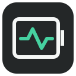
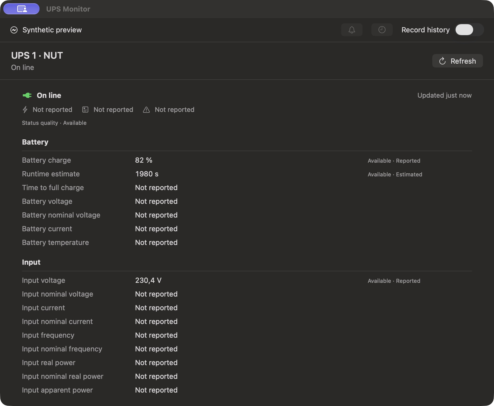
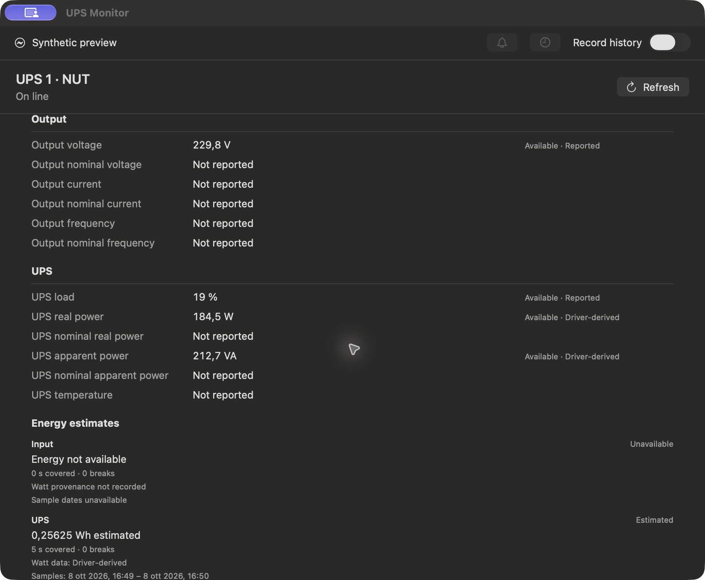

# UPS Monitor Mac

<p align="center">
  
</p>

<p align="center">
  <a href="https://github.com/pettipol/ups-monitor-macos/actions/workflows/ci.yml?query=branch%3Amain"></a>
  <a href="LICENSE"></a>
  <a href="docs/COMPATIBILITY.md"></a>
  <a href="docs/VERSIONING.md"></a>
</p>

**A local-first, read-only UPS monitor for macOS.** It combines Apple power-source observations with an optional user-configured Network UPS Tools (NUT) client path, and presents available readings in a menu-bar app, details window, local history, and a WidgetKit extension.

> **Source preview · `0.1.0-preview.1` · No public app release**
>
> The source, tests, and ad-hoc build are available for review. A partial synthetic-preview interaction check is recorded; overall GUI behavior, advanced UPS telemetry, installed widgets, and target-specific compatibility are not fully qualified. The deployment target and CI badge are not compatibility claims.

## What It Measures

| Area | What the code provides | Evidence and boundary |
|---|---|---|
| Synthetic app interaction | Details scrolling, history-metric picker, static Refresh action and normal Quit/reopen path | A partial check used fixture data. It does not establish live acquisition, source/backend selection, menu-bar popover behavior, VoiceOver or widget interaction; see [visual evidence](docs/SCREENSHOTS.md). |
| Apple power-source service | Sanitized UPS status, battery charge and battery voltage when reported | One qualitative native observation is recorded. It did not provide AC voltage or active watts; it is not device compatibility or sustained-read evidence. |
| NUT client path | Allowlisted decoding, bounded local client, and optional configured source | Synthetic loopback fixtures only. No live NUT server or UPS compatibility is claimed. The app does not install or start a driver or server. |
| Energy estimates | Separate `inputRealPower` and `upsRealPower` channels; application-estimated Wh with coverage, gaps and provenance | Synthetic integration and host tests only. No target-UPS watt reading or real energy accuracy is qualified. Estimates remain in memory and export separately from history. |
| Local history | Explicitly opt-in SQLite recording, bounded browsing and JSON/CSV export | Recording defaults off. Synthetic tests do not establish long-term retention behavior on a user account. |
| Widget | A small/medium WidgetKit extension and validated snapshot data path | The App Group, extension installation, system-hosted appearance and refresh behavior remain unqualified. |
| Alerts | Optional, default-off session alerts for selected monitoring conditions | macOS authorization and actual banner presentation remain unqualified. Alerts are not shutdown protection. |

The native service observation excluded the Mac's internal battery from monitored sources. No USB interface was opened. Readings can be missing; missing is never represented as zero. Watts (`W`), volt-amperes (`VA`) and estimated watt-hours (`Wh`) are distinct quantities, with derived values, estimates and stale captures labelled. See the [compatibility matrix](docs/COMPATIBILITY.md) and [native observation](docs/NATIVE_BASELINE.md) for the evidence boundary.

**Not a shutdown controller:** there are no UPS control commands, self-tests, calibration, buzzer operations, driver installation, background service, required account, network telemetry or cloud dependency. Do not disable existing macOS power-management services to use this project.

## Visuals

These screenshots show the macOS app running its explicit **Synthetic preview**. Every value is fixture data: these are **not UPS measurements**. They show application windows, not an installed WidgetKit extension. The [visual evidence gallery](docs/SCREENSHOTS.md) records provenance and the partial interaction check.

<p align="center">
  
  
</p>

The [offscreen render probe](docs/RENDER_PROBE.md) is separate from these app captures; its widget canvas is not a system-hosted widget screenshot. A representative offscreen canvas and its placeholder warning are in the [visual evidence gallery](docs/SCREENSHOTS.md).

## Quickstart

Requirements for the pinned validation workflow: macOS, Xcode 27.0 build `27A266a`, Apple Swift 6.4 and Python 3.14.8. The Swift package declares macOS 14+, but that deployment setting is not evidence of runtime support on macOS 14. For the current baseline and exact validation sequence, see [local validation](docs/VALIDATION.md).

```sh
git clone https://github.com/pettipol/ups-monitor-macos.git
cd ups-monitor-macos

# Synthetic parser/preflight checks, Swift/Python tests, and ad-hoc build checks.
bash scripts/check.sh
```

The script does not launch the app, widget, probe, or UPS driver. To build and open the app in its explicit synthetic preview:

```sh
xcodebuild -project UPSMonitor.xcodeproj -scheme UPSMonitor \
  -configuration Debug -derivedDataPath .build/preview build
open '.build/preview/Build/Products/Debug/UPS Monitor.app' --args --synthetic-preview
```

The synthetic preview uses fixture data and does not start live acquisition or history recording. The default local build has no App Group configured and is not a notarized distribution.

## Optional Native Read

This is separate from the quickstart and the synthetic preview. After reviewing the [native baseline](docs/NATIVE_BASELINE.md), an explicit one-shot session probe can read the existing Apple power-source service:

```sh
swift run ups-probe --session
```

It emits sanitized JSON with opaque process-local source IDs. It does not open USB interfaces or start an UPS driver. This command is not a NUT test and does not qualify compatibility. Do not use experimental NUT drivers as a substitute; their hardware and USB behavior is `NOT RUN` and requires separate safety review and explicit consent.

## Architecture

- `ApplePowerSource` reads the documented Apple service; `UPSRuntime` coordinates snapshots and adapts the optional NUT client path.
- `UPSModel` defines the shared typed snapshot, units, status, provenance and validation rules.
- `UPSMonitorUI` contains menu, details, energy and history presentation components; `UPSAppHost` connects those components to app state.
- `UPSEnergy` integrates eligible input and UPS active-watt samples in memory; `UPSHistory` provides opt-in local persistence and browsing.
- `UPSWidgetData`, `UPSWidgetBridge` and `UPSWidgetUI` define the latest-snapshot path and widget view. System App Group operation is not yet qualified.

## Project Status

The current source version is `0.1.0-preview.1`; it is a preview label, not a public app release or download. Hosted CI runs synthetic tests, release builds, plist checks and an ad-hoc signature check. It does not launch the app or probe hardware; optional NUT-client interop is separately gated. See the [CI record](docs/CI.md) for the exact run, toolchain and skipped checks.

Current release gates include real interactive GUI review, target-specific advanced telemetry, installed widget/App Group behavior, accessibility and VoiceOver, actual notification presentation, and validated distribution. The [release checklist](docs/RELEASE_CHECKLIST.md) keeps these separate from compile and synthetic-test results.

## Documentation

| Topic | Document |
|---|---|
| Architecture and app host | [Architecture](docs/ARCHITECTURE.md) · [App host](docs/APP_HOST.md) |
| Data, privacy and security | [Privacy policy](PRIVACY.md) · [Security reporting](SECURITY.md) |
| Compatibility and observations | [Compatibility matrix](docs/COMPATIBILITY.md) · [Native baseline](docs/NATIVE_BASELINE.md) |
| NUT | [Feasibility and boundaries](docs/NUT_FEASIBILITY.md) · [Runtime](docs/NUT_RUNTIME.md) · [Client completion qualification](docs/NUT_CLIENT_COMPLETION.md) · [Experimental driver guards](docs/NUT_GUARDS.md) |
| History and energy | [History storage](docs/HISTORY.md) · [History browsing](docs/HISTORY_BROWSING.md) · [Energy tracker](docs/ENERGY_TRACKER.md) · [Energy UI](docs/ENERGY_UI.md) |
| Widget and alerts | [Widget signing and limits](docs/WIDGET_SIGNING.md) · [Alert policy](docs/ALERT_POLICY.md) · [Alert delivery](docs/ALERT_DELIVERY.md) |
| Build and release | [CI](docs/CI.md) · [Local validation](docs/VALIDATION.md) · [Versioning](docs/VERSIONING.md) · [Release checklist](docs/RELEASE_CHECKLIST.md) |
| Project and participation | [Presentation notes](docs/PROJECT_PRESENTATION.md) · [Screenshots and visual evidence](docs/SCREENSHOTS.md) · [Contributing](CONTRIBUTING.md) · [Third-party notices](THIRD_PARTY_NOTICES.md) · [Changelog](CHANGELOG.md) |
| Italiano | [Guida italiana](docs/GUIDA_ITALIANA.md) |

## License

Original project code is MIT-licensed; third-party components retain their own terms. NUT-derived patches and their applicable license are documented separately in [third-party notices](THIRD_PARTY_NOTICES.md). This source preview does not distribute a NUT binary. See [LICENSE](LICENSE) and the notices before reuse or redistribution.
