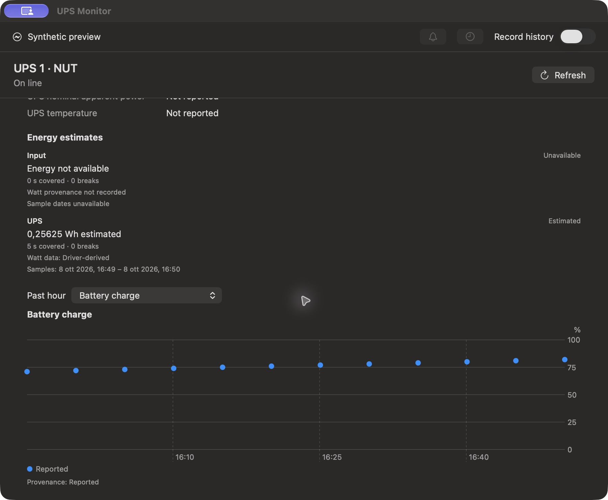
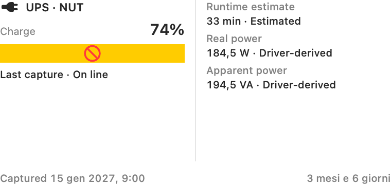

# Screenshots and Visual Evidence

Captured and reviewed on 2026-10-08. These are original project artifacts, not
marketing mockups. All displayed readings are **synthetic fixtures**, not
measurements from a connected UPS. No installed-widget screenshot is available.

## Running App

The following unedited, window-only JPEGs were captured from the actual native
app launched with `--synthetic-preview`, on macOS 27.0.1 / Apple Silicon.
The Release build used application/view code at source commit
`fa32a3577b1d928532c0c417fc31f2538ea2efd8`; subsequent source-version metadata
and documentation changes do not change these views. Each image is 1800 x 1480
pixels (a 900 x 740 point window). English app strings and the host's Italian
number/date formatting are both visible. The colored title-bar sharing indicator
belongs to macOS capture, not the product's design or a cloud feature.

### Battery and Input

The fixture supplies charge, a runtime estimate and an input voltage. Missing
fields remain "Not reported". This is a view demonstration, not evidence that
Apple's native service supplies those AC readings or that this UPS reports them.

### Output and Power

Output voltage, load, active power and apparent power are distinct rows. The
fixture deliberately labels watts and VA as driver-derived. "UPS real power"
is not automatically an output-location measurement. The scroll viewport clips
the continuation of the energy section; the next image shows that section.

### Energy and History

The UPS energy estimate has only five covered seconds. Input energy is
unavailable because eligible input watts are absent. The battery-charge plot is
synthetic history; recording is off. Neither this image nor the fixture's clock
is evidence of continuous live acquisition or energy-meter accuracy.

## Widget View: Offscreen Only

This is an existing `ups-render-probe` output from the same source revision,
rendering `UPSWidgetView` directly with SwiftUI `ImageRenderer`, at 380 x 180
points / scale 2. It does **not** run WidgetKit, the timeline provider or App
Group storage, and is **not** a screenshot of a desktop-installed widget.

The yellow blocked bar is the renderer's unsupported-control placeholder for
`ProgressView`, not the proposed final UI. The fixture uses a January 2027 date,
while the relative-date label follows the October 2026 host clock. Do not infer
live freshness, final proportions, enlarged-text support or production behavior
from this canvas. See [render limitations](RENDER_PROBE.md) and
[the outstanding widget checks](WIDGET_SIGNING.md).

## Interactive Check: Partial

The coordinating reviewer observed these synthetic app behaviors:

- The details window opened and exposed its text and controls to the inspection
  tool; alerts, stored-history browsing and recording were disabled in preview.
- Scrolling reached power, energy and history without observed text overlap in
  this one default-size dark-mode window.
- Selecting UPS real power in the history picker showed "No history data",
  rather than inventing samples absent from the charge-only fixture.
- Refresh kept the static preview unchanged.
- The normal application-menu Quit command ended the owned process; reopening
  with the same explicit preview flag succeeded.

This is not full accessibility or UI acceptance. VoiceOver, enlarged text,
light-mode app layout, other window sizes, the menu-bar popover, actual history
and exports, notifications, backend settings and installed-widget interaction
remain unqualified. The preview never publishes to the shared widget cache.

## Asset License

The project mark is an original MIT-licensed vector asset. It is a repository
identity mark, not an installed app icon or an APC/Apple/NUT logo. Screenshots
are genuine captures of this project's UI and contain no hardware identifiers,
account data or private desktop content. They are distributed with the project
under its license; third-party platform symbols remain subject to their owners'
terms. No image was generated or retouched to imply a passing hardware test.
